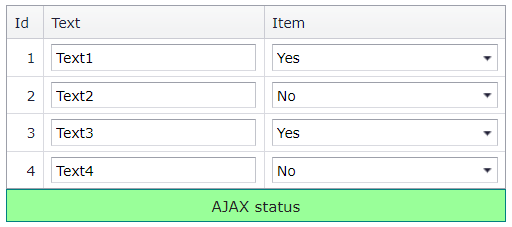

<!-- default badges list -->

[](https://supportcenter.devexpress.com/ticket/details/E3326)
[](https://docs.devexpress.com/GeneralInformation/403183)
<!-- default badges end -->
# Grid View for ASP.NET MVC - How to use template editors to update grid data
<!-- run online -->
**[[Run Online]](https://codecentral.devexpress.com/128551807/)**
<!-- run online end -->

This example demonstrates how to create a templated column, add an editor to the template, and call the [jQuery.ajax](http://api.jquery.com/jQuery.ajax/) method to get the editor's value and pass it to the server.

> **Note**  
> In v13.2 and higher, you can use the batch edit functionality to edit grid data on the client and send it to the server on a single request: [Grid in Batch Edit Mode](https://docs.devexpress.com/AspNetMvc/16147/components/grid-view/data-editing-and-validation/batch-edit).



## Overview

Call a column's [SetDataItemTemplateContent](https://docs.devexpress.com/AspNetMvc/DevExpress.Web.Mvc.MVCxGridViewColumn.SetDataItemTemplateContent.overloads) method and add an editor to the template. Assign a client-side `ValueChanged` event handler to the editor and pass the row's key value and the column's field name as parameters.

```cshtml
column.SetDataItemTemplateContent(c => {
    Html.DevExpress().ComboBox(cmbSettings => {
        cmbSettings.Name = "cmb" + c.KeyValue;
        <!-- ... -->
        cmbSettings.Properties.ClientSideEvents.ValueChanged = String.Format("function (s, e) {{ OnValueChanged(s, '{0}', {1}, '{2}'); }}",
            c.Column.FieldName, c.KeyValue, Url.Action("UpdateValue", "Home", null));
    }).Bind(DataBinder.Eval(c.DataItem, c.Column.FieldName)).Render();
});
```

In the editor's `ValueChanged` event handler, call the [jQuery.ajax](http://api.jquery.com/jQuery.ajax/) method to get the new editor's value and pass it to the server.

```js
function OnValueChanged(s, fieldName, keyValue, url) {
    $.ajax({
        type: "POST",
        url: url,
        data: { key: keyValue, field: fieldName, value: s.GetValue() },
        beforeSend: function () {
            $(".status").text("Request has been sent");
        },
        success: function (msg) {
            $(".status").html(msg);
        }
    });
}
```

## Files to Review

* [HomeController.cs](./CS/E3326/Controllers/HomeController.cs) (VB: [HomeController.vb](./VB/E3326_VB/Controllers/HomeController.vb))
* [Script.js](./CS/E3326/Scripts/Script.js) (VB: [Script.js](./VB/E3326_VB/Scripts/Script.js))
* [GridViewPartial.cshtml](./CS/E3326/Views/Home/GridViewPartial.cshtml) (VB: [GridViewPartial.vbhtml](./VB/E3326_VB/Views/Home/GridViewPartial.vbhtml))

## Documentation

* [Gid View Templates](https://docs.devexpress.com/AspNet/3718/components/grid-view/concepts/templates)

## More Examples

* [Grid View for ASP.NET Web Forms - How to use template editors to update grid data](https://github.com/DevExpress-Examples/asp-net-web-forms-grid-use-template-editors-to-update-data-on-callbacks)
